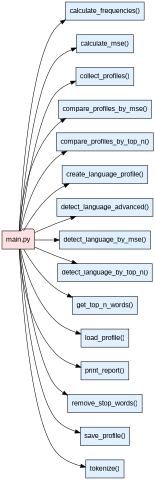

Лабораторная работа №1. Определение языка текста на основе частотного словаря
=============================================================================

.. toctree::
    :maxdepth: 1
    :titlesonly:

    Full API <lab_1_classify_profile.api.rst>

Дано
----

1. Три текста на английском (``assets/texts/en.txt``),
   немецком (``assets/texts/de.txt``) и
   неизвестном (``assets/texts/unknown.txt``) языках.
2. Необходимо определить, на каком языке написан неизвестный текст с
   помощью частотных слов, характерных для конкретного языка

UML-диаграмма
-------------

Что надо сделать
----------------

Шаг 0. Начать работу над лабораторной (вместе с преподавателем на практике)
~~~~~~~~~~~~~~~~~~~~~~~~~~~~~~~~~~~~~~~~~~~~~~~~~~~~~~~~~~~~~~~~~~~~~~~~~~~

1. Создайте форк репозитория.
2. Установите необходимые инструменты для работы.
3. Измените файлы ``main.py`` и ``start.py``.
4. Закоммитьте изменения и создайте Pull request.

.. important:: В файле ``start.py`` вы должны написать код, определяющий
               язык неизвестного текста.

Для этого реализуйте функции в модуле ``main.py`` и импортируйте их в
``start.py``. Весь код, выполняющий детектирование языка, должен быть
выполнен в функции ``main`` в файле ``start.py``:

.. code:: py

   def main() -> None:
       pass

Вызов функции в файле ``start.py``:

.. code:: py

   if __name__ == '__main__':
       main()

В рамках данной лабораторной работы **нельзя использовать модули
collections, itertools, а также сторонние модули.**

Обратите внимание, что желаемую оценку необходимо указать в файле
``settings.json`` в поле ``target_score``. Возможные значения: 0, 4, 6, 8, 10.
Чем большее значение выставлено, тем больше тестов будет запущено.

.. important:: Если на вход функции подаются аргументы неправильных типов
               или при выполнении функции возникли проблемы, то по умолчанию
               необходимо прервать работу функции и вернуть специальное значение ``None``.
               Случаи, в которых требуется другой вывод, описаны в докстрингах функций.

Шаг 1. Токенизировать текст
~~~~~~~~~~~~~~~~~~~~~~~~~~~

Реализуйте функцию :py:func:`lab_1_classify_profile.main.tokenize`.
Функция принимает на вход текст в виде строки
и возвращает последовательность слов (токенов) без знаков препинания
в нижнем регистре.

Токены могут состоять только из букв (не допускаются цифры и любые другие
символы внутри слова). При этом любые символы (кроме букв) внутри токена
удаляются, например, don't заменяется на dont, round-up на roundup и т.д.

Например, строка ``'Hey! How are you?'`` должна быть токенизирована
следующим образом: ``['hey', 'how', 'are', 'you']``.

Шаг 2. Получить токены без стоп-слов
~~~~~~~~~~~~~~~~~~~~~~~~~~~~~~~~~~~~

Реализуйте функцию :py:func:`lab_1_classify_profile.main.remove_stop_words`.
Функция принимает на вход токены и стоп-слова,
и возвращать последовательность токенов без стоп-слов.

Если на вход подаются некорректные стоп-слова, токены возвращаются без изменений.
Пустая последовательность стоп-слов (список или кортеж) не считается некорректным
значением.

Шаг 3. Получить частотный словарь по заданному тексту
~~~~~~~~~~~~~~~~~~~~~~~~~~~~~~~~~~~~~~~~~~~~~~~~~~~~~

Реализуйте функцию
:py:func:`lab_1_classify_profile.main.calculate_frequencies`.
Функция принимает на вход токены и возвращает частотный словарь,
где ключ — токен, значение — число (относительная частота).

Под относительной частотой подразумевается отношение количества
вхождений токена к общему числу токенов.
Так, из последовательности токенов
``['hey', 'how', 'are', 'you', 'hey', 'you', 'too']``
должен получиться следующий словарь частот:

.. code:: py

   {
      'hey': 0.286,
      'how': 0.143,
      'are': 0.143,
      'you': 0.286,
      'too': 0.143,
   }

Округлять числа в данном словаре не требуется.

Шаг 4. Получить первые N популярных слов
~~~~~~~~~~~~~~~~~~~~~~~~~~~~~~~~~~~~~~~~

.. important:: Выполнение Шагов 1-4 соответствует 4 баллам.

Реализуйте функцию
:py:func:`lab_1_classify_profile.main.get_top_n_words`.
Функция принимает на вход частотный словарь и число топ N слов.

Функция должна возвращать первые N популярных слов
в порядке от самого популярного до наименее популярного.
Если число N больше числа слов в словаре,
то возвращаются все слова в порядке убывания их частоты.

.. important:: Выполните практическое задание ниже.

Продемонстрируйте в файле ``start.py`` на основе текста
на немецком языке, сохранённого в переменную ``de_text``,
следующие действия:

1. Выделение токенов из текста;
2. Очистку токенов от стоп-слов;
3. Создание частотного словаря для очищенных токенов;
4. Вывод топ-7 популярных слов текста.

В качестве стоп-слов используйте слова из файла ``assets/stopwords.txt``,
уже сохранённые в переменную ``stopwords`` в ``start.py``.

Шаг 5. Создать профиль конкретного текста
~~~~~~~~~~~~~~~~~~~~~~~~~~~~~~~~~~~~~~~~~

**Профиль языка** — это структура с информацией о конкретном языке.
Подобная простейшая языковая модель часто используется в задаче
определения языка. В настоящей лабораторной работе профиль языка
состоит из названия языка, частотного словаря и количества токенов
в данном словаре.

Чаще языковые профили содержат информацию о n-граммах
(последовательностях из n элементов, включенных в другую
последовательность). Пример языковых профилей вы можете найти в
`следующем проекте <https://github.com/shuyo/language-detection>`__.

В данной лабораторной работе рассматриваются языковые профили
конкретных текстов.

Обычно профиль языка текста выглядит следующим образом:

.. code:: py

   {
      "name": "en",
      "freq": {
         "happy": 0.5,
         "the": 0.5
      },
      "n_words": 2
   }

где

* ключу ``"name"`` соответствует название языка (строка),
* ключу ``"freq"`` — частотный словарь, где ключи — строки, а значения — числа с плавающей точкой,
* ключу ``"n_words"`` соответствует количество токенов в словаре (целое число),

В рамках данной лабораторной работы для удобства описания структуры языкового профиля
используется тип :py:class:`lab_1_classify_profile.main.ProfileType`, представляющий
собой более строгую, неизменяемую структуру в формате кортежа:

.. code:: py

   (
      "en",
      {
         "happy": 0.5,
         "the": 0.5
      },
      2,
   )

Шаг 5.1. Создать профиль
~~~~~~~~~~~~~~~~~~~~~~~~

Для создания профиля языка реализуйте функцию
:py:func:`lab_1_classify_profile.main.create_language_profile`.

Функция принимает на вход язык, текст и стоп-слова и
возвращает кортеж с вышеназванной структурой.

Используйте функцию :py:func:`lab_1_classify_profile.main.tokenize`
для токенизации, функцию
:py:func:`lab_1_classify_profile.main.remove_stop_words` для
очистки токенов и функцию
:py:func:`lab_1_classify_profile.main.calculate_frequencies`
для получения частотного словаря.

Шаг 5.2. Проверить профиль
~~~~~~~~~~~~~~~~~~~~~~~~~~

Реализуйте функцию :py:func:`lab_1_classify_profile.main.check_profile`,
которая проверяет полную структуру профиля. Она возвращает True, если структура
верная и False, если есть ошибки в типах или виде профиля.

В дальнейшем при работе профилями необходимо будет использовать эту функцию
для проверки профиля.

Шаг 6. Сравнить два языковых профиля по пересекающимся частотным словам
~~~~~~~~~~~~~~~~~~~~~~~~~~~~~~~~~~~~~~~~~~~~~~~~~~~~~~~~~~~~~~~~~~~~~~~

Простейший способ сравнения двух языковых профилей — найти совпадающие
слова и посмотреть, какую долю от всех слов они составляют.
На данном шаге предлагается найти долю пересекающихся
частотных слов для сравнения профилей.

Для этого необходимо разделить количество общих токенов на количество
токенов на неизвестном языке.
Например, если топ N слов для английского языка — `['a', 'an', 'the', 'by']`,
а для неизвестного — `['an', 'the', 'with', 'is']`. Количество общих
токенов — `2` (`['an', 'the']`), количество токенов на неизвестном
языке — `4`. Тогда доля пересекающихся частотных слов равна `2 / 4 = 0.5`.

Таким образом формула расчёта данной метрики представляет собой:

.. math::

   \frac{|UnknownProfile \cap LanguageProfile|}{|UnknownProfile|}

где

- :math:`UnknownProfile` и :math:`LanguangeProfile` — множества токенов
   в профилях неизвестного и известного языковых профилей;
- :math:`|UnknownProfile \cap LanguageProfile|` — размер пересечения множеств
   :math:`UnknownProfile` и :math:`LanguageProfile`;
- :math:`|UnknownProfile|` — размер профиля неизвестного языка.

Реализуйте функцию
:py:func:`lab_1_classify_profile.main.compare_profiles_by_top_n`.
Функция принимает на вход два языковых профиля и число топ N слов
и возвращает значение метрики.

Для получения топ N слов необходимо использовать функцию
:py:func:`lab_1_classify_profile.main.get_top_n_words`.
Для проверки профиля необходимо использовать
функцию :py:func:`lab_1_classify_profile.main.check_profile`.

Шаг 7. Определить язык неизвестного текста
~~~~~~~~~~~~~~~~~~~~~~~~~~~~~~~~~~~~~~~~~~
.. important:: Выполнение Шагов 1-7 соответствует 6 баллам.

Реализуйте функцию
:py:func:`lab_1_classify_profile.main.detect_language_by_top_n`,
которая определяет язык неизвестного текста на основе
популярных слов двух известных профилей.
Функция принимает на вход языковой профиль на неизвестном языке, два языковых
профиля на известных и число топ N слов.

Функция определяет язык текста на основе доли пересекающихся частотных слов и
возвращает название языка с наибольшей долей пересекающихся частотных
слов. Название языка находится в языковом профиле.
Если у двух языков одинаковое значение доли пересекающихся частотных слов,
отсортируйте названия языков в алфавитном порядке и возьмите первое.

Для нахождения доли пересекающихся частотных слов необходимо использовать
функцию :py:func:`lab_1_classify_profile.main.compare_profiles_by_top_n`.
Для проверки профиля необходимо использовать
функцию :py:func:`lab_1_classify_profile.main.check_profile`.

.. important:: Выполните практическое задание ниже.

Продемонстрируйте в `start.py` определение языка при помощи функции
:py:func:`lab_1_classify_profile.main.detect_language_by_top_n`.
Используйте тексты, сохранённые в переменные ``en_text``, ``de_text``
как основу для референсных профилей, и текст переменной ``unknown_text``
в качестве неизвестного языка. В качестве стоп-слов используйте список
из переменной ``stopwords``.
Определите язык на основе топ-15 популярных слов текста.

К какому языку принадлежит неизвестный текст, если сравнивать частотные слова?

Шаг 8. Рассчитать метрику ``MSE``
~~~~~~~~~~~~~~~~~~~~~~~~~~~~~~~~~

Другой способ рассчитать близость языковых профилей —
рассматривать частотность токенов относительно всего текста,
а не только популярных слов.

В дальнейшем для определения близости двух языковых профилей нам
понадобится метрика среднеквадратичной ошибки (``MSE``, `Mean Squared
Error <https://en.wikipedia.org/wiki/Mean_squared_error>`__). Для начала
рассмотрим эту метрику безотносительно применения к задаче детекции
языка.

Значение ``MSE`` рассчитывается по формуле
:math:`MSE = \frac{\sum (y_{i} - p_{i})^{2}}{n}`, где:

* ``y`` - истинное значение;
* ``p`` - предсказанное значение;
* ``n`` - количество значений.

Обратите внимание, что количество истинных значений ``y``
и количество предсказанных значений ``p`` совпадает и равно ``n``.

Таким образом, метрика ``MSE`` - не что иное, как среднее квадратов
разности между истинными значениями и предсказанными значениями. Чем это
значение меньше, тем ближе предсказанные значения к истинным.

Использование данной метрики для измерения близости языковых профилей
показывает, насколько близко друг к другу по значимости находятся
одинаковые токены в тексте. Чем больше токенов имеют близкие
относительные частоты в тексте, тем больше
вероятность, что тексты принадлежат одному языку.

Для того чтобы рассчитать метрику ``MSE``,
реализуйте функцию :py:func:`lab_1_classify_profile.main.calculate_mse`.

Шаг 9. Сравнить два языковых профиля с помощью метрики MSE
~~~~~~~~~~~~~~~~~~~~~~~~~~~~~~~~~~~~~~~~~~~~~~~~~~~~~~~~~~

Чтобы сравнить языковые профили необходимо рассчитать значение метрики
``MSE``, которая определяет различие между двумя языками.

Для этого нужно выделить все токены, встречающиеся в двух языковых
профилях, а также сопоставить им частотность в каждом из языков. Иными
словами, мы находим объединение множества токенов в первом языке со
множеством токенов во втором языке. Далее, для каждого из токенов
находим его встречаемость в каждом из множеств.

Для примера рассмотрим два языковых профиля:

.. code:: py

   profile_1 = (
      'lang1',
      {
         'happy': 0.5,
         'sad': 0.5
      },
      2
   )
   profile_2 = (
      'lang2',
      {
         'sad': 0.5,
         'tired': 0.5
      },
      2
   )

В данных профилях встречаются следующие токены: [``happy``, ``sad``, ``tired``].
При этом в профиле первого языка их встречаемость равна
``[0.5, 0.5, 0.0]``, а в профиле второго языка - ``[0.0, 0.5, 0.5]``.
То есть для токенов, отсутствующих в другом профиле, встречаемость будет 0.0.

Приняв встречаемость символов в первом языке за истинные значения и
встречаемость символов во втором языке за предсказанные, мы можем
рассчитать разницу профилей по метрике ``MSE``. Ее значение будет равно
``0.167`` (с округлением до третьего знака).

.. note:: Что изменится, если сделать наоборот и принять за истинные
          значения встречаемость токенов во втором языке и за предсказанные -
          в первом? Почему?

Реализуйте функцию сравнения двух языковых профилей
:py:func:`lab_1_classify_profile.main.compare_profiles_by_mse`.

Для расчета метрики ``MSE`` нужно обратиться к функции
:py:func:`lab_1_classify_profile.main.calculate_mse`.
Для проверки профиля необходимо использовать
функцию :py:func:`lab_1_classify_profile.main.check_profile`.

Шаг 10. Определить язык неизвестного текста
~~~~~~~~~~~~~~~~~~~~~~~~~~~~~~~~~~~~~~~~~~~

.. important:: Выполнение Шагов 1-10 соответствует 8 баллам.

Чтобы определить язык неизвестного текста, реализуйте функцию
:py:func:`lab_1_classify_profile.main.detect_language_by_mse`.

Она устанавливает язык текста на основе метрики ``MSE`` и
возвращает название языка с ее наименьшим значением. Название языка
находится в языковом профиле. Если у двух языков одинаковое значение
метрики, отсортируйте названия языков в алфавитном порядке и возьмите
первое.

Для нахождения метрики ``MSE`` нужно использовать функцию
:py:func:`lab_1_classify_profile.main.compare_profiles_by_mse`.

.. important:: Выполните практическое задание ниже.

Продемонстрируйте в `start.py` определение языка при помощи
:py:func:`lab_1_classify_profile.main.detect_language_by_mse`
на профилях, созданных на Шаге 7.

К какому языку принадлежит неизвестный текст?

.. note:: Чем этот подход MSE отличается от подхода на основе популярных слов?
          Чем они схожи? Различаются ли ответы на основе двух метрик?

Для проверки профиля необходимо использовать
функцию :py:func:`lab_1_classify_profile.main.check_profile`.

Шаг 11. Сохранить языковой профиль
~~~~~~~~~~~~~~~~~~~~~~~~~~~~~~~~~~

Для определения языка может быть недостаточно двух языковых профилей. На
самом деле в данной задаче может использоваться произвольное количество
языковых профилей (например, 6).
В рамках модуля `start.py` вы работаете с маленькими текстами.
Но представьте, что вам нужно обработать огромный корпус текстов и получить
по ним языковой профиль. Сколько времени занимает данная обработка?
Хотели ли бы вы её выполнять каждый раз при определении языка неизвестного
текста?

Для дальнейшей работы нам потребуется возможность загружать языковой
профиль из файла с расширением ``json``. Узнать больше об этом типе
файлов можно `здесь <https://en.wikipedia.org/wiki/JSON>`__.

Для чтения и сохранения такого типа файлов часто используется
стандартный модуль ``json``. Изучить его документацию можно по
`ссылке <https://docs.python.org/3/library/json.html>`__.

Созданный языковой профиль необходимо сохранять в файл для дальнейшего использования.
В последующие разы языковой профиль необходимо загружать из уже созданного ранее файла.

Функция :py:func:`lab_1_classify_profile.main.save_profile`
принимает на вход языковой профиль и путь до папки сохранения профиля.
Функция записывает профиль в файл с расширением
``.json`` в вышеназванном формате. Файл языкового профиля должен называться
``"*.json"``, где `*` — название языка.
Для проверки профиля необходимо использовать
функцию :py:func:`lab_1_classify_profile.main.check_profile`.

Для записи и загрузки языкового профиля **необходимо использовать библиотеку `json`.**

Для удобства сохранения и загрузки профилей, необходимо привести профиль к
базовому формату словаря, описанному на Шаге 5.

.. code:: py

   {
      "name": "en",
      "freq": {
         "happy": 0.5,
         "the": 0.5
      },
      "n_words": 2
   }

При работе с файлами, укажите ``encoding="utf-8"`` — это стандартный формат кодирования
текстовых файлов.

В упомянутом нами ранее `проекте <https://github.com/shuyo/language-detection>`__
профили хранятся в файле одной строкой, что не очень удобно для просмотра.
``json`` позволяет делать отступы в сохраняемом файле. Для этого можно
использовать аргумент ``indent``, обычно со значением 4. Чтобы удостовериться,
что все символы будут отображаться в файле правильно, используйте
``ensure_ascii=False``.

Шаг 12. Загрузить языковой профиль
~~~~~~~~~~~~~~~~~~~~~~~~~~~~~~~~~~

Реализуйте функцию чтения языкового профиля из файла
:py:func:`lab_1_classify_profile.main.load_profile`.
При этом функция должна только читать файл,
никакой дополнительной обработки не подразумевается.

Функция :py:func:`lab_1_classify_profile.main.load_profile`
принимает на вход путь к файлу с расширением `.json`
с языковым профилем. Содержимое данного файла представляет собой словарь.
Функция :py:func:`lab_1_classify_profile.main.load_profile` должна возвращать ``ProfileType``.
Полученный профиль необходимо проверить с помощью функции
:py:func:`lab_1_classify_profile.main.check_profile`.

Шаг 13. Собрать языковые профили
~~~~~~~~~~~~~~~~~~~~~~~~~~~~~~~~

Поскольку нам предстоит сравнить целый ряд языковых профилей,
нужно загрузить и предобработать сразу несколько профилей.

Для этого реализуйте функцию
:py:func:`lab_1_classify_profile.main.collect_profiles`,
которая должна вызывать :py:func:`lab_1_classify_profile.main.load_profile`.

.. important:: Выполните практическое задание ниже.

Продемонстрируйте сохранение и загрузку профилей из текстов
в папке ``assets/texts`` в папку ``assets/profiles``. Например, путь к
испанскому языковому профилю должен выглядеть так:
``lab_1_classify_profile/assets/profiles/es.json``.
Используйте функции
:py:func:`lab_1_classify_profile.main.save_profile` и
:py:func:`lab_1_classify_profile.main.collect_profiles`.

Шаг 14. Определить язык неизвестного текста
~~~~~~~~~~~~~~~~~~~~~~~~~~~~~~~~~~~~~~~~~~~

Теперь мы готовы определить язык неизвестного текста, рассматривая сразу
несколько возможных вариантов и несколько метрик.

Для этого реализуйте функцию
:py:func:`lab_1_classify_profile.main.detect_language_advanced`.
Она возвращает отсортированные кортежи вида
``[('lang1', score_dict), ('lang2', score_dict)]``, где первым
элементом кортежа выступает название языка, а вторым - cловарь,
содержащий значения близости профилей по популярным словам и ``MSE``.
Сортировка предполагается от лучшего к худшему значению,
сначала по ``MSE``, затем по популярным словам. Языки
с совпадающими значениями метрик нужно упорядочить
лексикографически.

.. note:: Как лучше сортировать обе метрики? От меньшего к большему
          или наоборот? Отличаются ли способы сортировки?

Для вычисления метрик используйте функции
:py:func:`lab_1_classify_profile.main.compare_profiles_by_top_n` и
:py:func:`lab_1_classify_profile.main.compare_profiles_by_mse`.
Для проверки профилей необходимо использовать
функцию :py:func:`lab_1_classify_profile.main.check_profile`.

Шаг 15. Сформировать отчет
~~~~~~~~~~~~~~~~~~~~~~~~~~

.. important:: Выполнение Шагов 1-15 соответствует 10 баллам.

Теперь, когда мы можем сравнить целый ряд языков, можно
получить достаточную информацию о неизвестном тексте.
Для этого сформируйте отчёт о характеристиках языка
и его близости к известным языковым профилям текстов.

Для этого реализуйте функцию
:py:func:`lab_1_classify_profile.main.print_report`,
которая выводит отчет в следующей форме:

.. code:: py

   Unknown language stats
   ======================
   Popular words: ['a', 'and']
   Max length word: 'bartender'
   Min length word: 'a'
   Average token length: 4.09524

   Language scores
   ---------------
   en: MSE 0.00013   Top-N Score 0.66667
   de: MSE 0.00016   Top-N Score 0.66667
   fr: MSE 0.0001    Top-N Score 0.66667

где

- `"Popular words"` — отсортированные по алфавиту топ N частотных слов;
- `"Min length word"` — слово с максимальным количеством букв;
- `"Min length word"` — слово с минимальным количеством букв;
- `"Average token length"` — среднее количество букв в словах;
- `"Language scores"` — значение метрик схожести известных профилей с неизвестным профилем.

Обратите внимание, что все вещественные числа необходимо округлить до пяти знаков
после запятой.

Для получения топ N пересекающихся частотных слов необходимо использовать функцию
:py:func:`lab_1_classify_profile.main.get_top_n_words`.
Для проверки профиля необходимо использовать
функцию :py:func:`lab_1_classify_profile.main.check_profile`.

.. important:: Выполните практическое задание ниже.

Продемонстрируйте детекцию неизвестного языка с помощью функции
:py:func:`lab_1_classify_profile.main.detect_language_advanced`
путём сравнения с языковыми профилями текстов на английском,
немецком и латыни из папки ``assets/profiles`` в файле ``start.py``.
Основывайте результаты на топ-15 слов из текстов.

Выведите в консоль отчёт для неизвестного языка с помощью функции
:py:func:`lab_1_classify_profile.main.print_report`.

.. note:: Что можно сказать о неизвестном тексте?
         К какому языку он принадлежит, согласно двум способам детекции?
         Различаются ли значения MSE и метрики на основе популярных
         слов? Почему?

Полезные ссылки
---------------

-  `Коллекция языковых
   профилей <https://github.com/shuyo/language-detection>`__
-  `Описание метрики Mean Squared
   Error <https://en.wikipedia.org/wiki/Mean_squared_error>`__
-  `Описание формата JavaScript Object
   Notation <https://en.wikipedia.org/wiki/JSON>`__
-  `Описание стандартной библиотеки
   json <https://docs.python.org/3/library/json.html>`__
