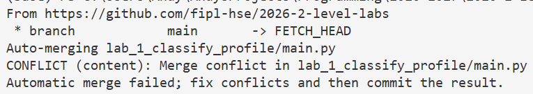
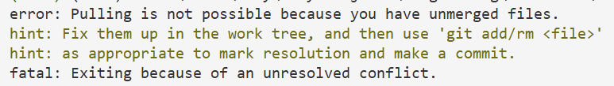
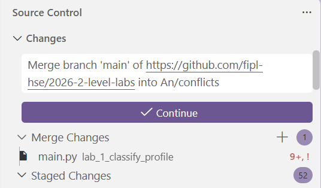
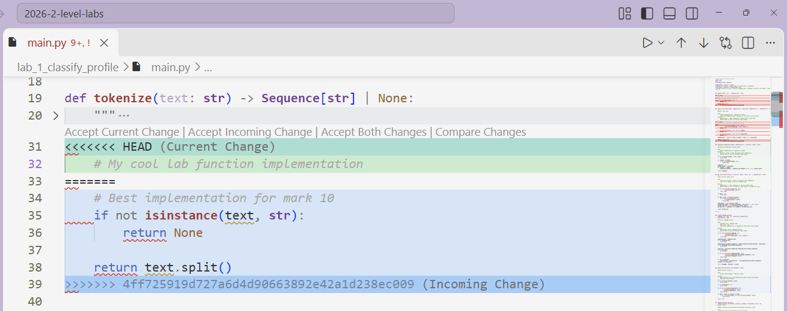

.. _conflicts-label:

Разрешение конфликтов в VSCode
==============================

В процессе написания лабораторной работы, Ваш форк могут обновлять улучшениями основного репозитория.

После анонса об обновлении форков, необходимо выполнить команду ``git pull --rebase``,
прежде чем делать ``git push`` Ваших новых изменений.

Также эти обновления проходят после основного дедлайна каждой лабораторной работы.
Преподаватели курса выбирают лучшую реализацию лабораторной на оценку 10,
и она становится частью основного репозитория.

Если обновление затронуло файлы, которые у Вас уже изменены, у Вас возникнут конфликты.
Конфликты означают, что Вы не сможете сделать ``git commit/push``, пока не разрешите их.

В терминале сообщение о конфликте может выглядеть следующим образом:

Сообщение может выглядеть и иначе, в зависимости от тех действий, которые Вы пытаетесь
предпринять, однако сообщения всегда содержат ключевую информацию о том, что это именно конфликт.
Также сообщение может содержать подсказки о том, как конфликт разрешить, и о том, какие файлы имеют конфликты.

Если сообщение о конфликтах не позволяет выполнять другие команды, закройте терминал и откройте новый — входящие
файлы прогрузятся в VSCode, и Вы сможете посмотреть на конфликты.

На вкладке ``Source Control`` файлы с конфликтами находятся в блоке ``Merge Changes`` и отмечены восклицательном знаком `!`.

Когда Вы откроете файл с конфликтами, в нём будут структуры следующего формата:

Та часть, которая находится между ``<<<`` и ``===``, отмеченная как ``HEAD (Current Change)``
— это Ваша имплементация.
То, что находится между ``===`` и ``>>>`` и отмечено как ``<Commit SHA> (Incoming Change)``
— это изменения, которые были добавлены после обновления форка.

Справа на полосе прокрутки указаны все места, где содержатся конфликты.

Чтобы разрешить конфликт, нужно выбрать одну из опций — ``Accept Current Change`` или ``Accept Incoming Change``
(кнопки находятся сверху блока конфликтов, сразу над ``<<<``).
Выбор зависит от того, в какой ситуации Вы находитесь:

1. **Ситуация 1:** Вы сдали лабораторную работу, в которой возникли конфликты.

    В таком случае для каждого блока конфликтов выбирайте ``Accept Incoming Change``.

    Можете также воспользоваться полным принятием входящих изменений, кликнув правой кнопкой мыши на файл
    в ``Merge Changes``, затем ``Accept All Incoming``.

    .. image:: _static/conflicts_resolution/accept_all.png

2. **Ситуация 2:** Вы **НЕ** сдали лабораторную работу, в которой возникли конфликты.

    В таком случае выбирайте ``Accept Current Change`` — Ваша реализация будет сохранена.
    Также можно использовать опцию ``Accept All Current``.

    После того, как Вы сдадите лабораторную работу, Вам понадобится обновить файлы — у Вас должна
    остаться лучшая реализация из основного репозитория.
    Для этого можно будет использовать команду ``git checkout upstream/main lab_1_classify_profile``.
    Если при использовании команды терминал выводит ошибку о существовании ``upstream``,
    обратитесь к инструкции из :ref:`FAQ <discard-changes-checkout>`.

3. **Ситуация 3:** Это рядовое обновление, которое затронуло файлы, над которыми Вы работаете.

    В таком случае рекомендуется принять все входящие изменения (``Accept Incoming Change``).

    Если же Вам нужно что-то оставить из Вашего кода, выберете ``Accept Both Changes`` и измените
    полученный код под тот результат, который Вас устроит.

В результате разрешения конфликтов у Вас не должно остаться блоков с ``<<<``, ``===`` и ``>>>``.

После разрешения конфликтов в файле выполните следующие шаги:

1. Сохраните файл с разрешёнными конфликтами (``Ctrl+S``).

2. Индексируйте изменения:

    Выполните ``git add`` для нужного файла или во вкладке ``Source Control``
    нажмите на плюс рядом с именем файла.

    .. image:: _static/conflicts_resolution/stage_changes.png

3. Разрешите конфликты во всех остальных файлах с конфликтами, для каждого выполните шаги 1-2.

4. Закоммитьте изменения:

    Выполните ``git commit -m "<merge-message>"`` или нажмите ``Continue`` во вкладке ``Source Control``
    (важно, чтобы все файлы из блока ``Merge Changes`` переместились в блок ``Staged Changes``, иначе коммит сделать не получится).

    .. image:: _static/conflicts_resolution/commit_changes.png

5. После того, как конфликты разрешены и изменения закоммичены, Вы можете продолжать работать над
    лабораторными — ``git push`` будет работать корректно.
