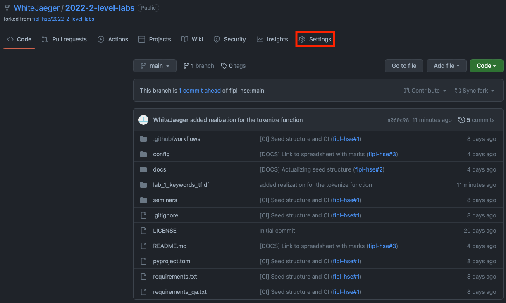

.. _starting-guide-en-label:

.. contents:: Contents:
   :depth: 2

Starting guide
==============

Before starting the “Computer Tools for Linguistic Research” course,
each student needs to take a few steps that will prepare the necessary
tools for further work.

.. contents:: Content:
   :depth: 2

Check you have everything you need
----------------------------------

We assume that after completing the **“Programming for Linguists”**
course, you have:

-  Python interpreter
-  Git version control system
-  Development environment Visual Studio Code
-  GitHub account

If you do not have any of these, go back to steps 1-5 from `Подготовка к прохождению курса
<https://github.com/fipl-hse/2025-2-level-labs/blob/main/docs/public/starting_guide_ru.rst>`__.

Fork the repository
-------------------

To fork a repository on the Github, follow these steps:

1. Open the repository site that your lecturer has sent you.
2. In the upper right corner click ``Fork``.

   .. figure:: _static/starting_guide/github_forking_1.png
      :alt: forking_1

3. Click ``Create Fork``.

   .. figure:: _static/starting_guide/github_forking_2.png
      :alt: forking_2

You have forked a repository! Pay attention to the link in the address
bar of the browser: it should contain your Github username and the name
of the repository: ``https://github.com/<your-username>/202X-2-level-ctlr``.

   .. image:: _static/starting_guide/github_forking_3.png

Add collaborators
-----------------

Only you can make changes to your fork. However, during the course,
your mentors will need to make changes
to your fork: add changes from the main fork, resolve conflicts, etc.
You should add them to **collaborators**, so they have such an
opportunity.

To do this, follow these steps:

1. Open the fork site you created in the `Fork the repository <#creating-fork>`__ step.

   1. **NB**: Pay attention to the link in the address bar of the browser:
      it should contain your Github username and the name of the repository.

2. Click ``Settings``.



3. Select ``Collaborators`` from the left menu.

   .. figure:: _static/starting_guide/github_collaborators_tab.png
      :alt: add collaborator tab

4. Click ``Add people``.

   .. figure:: _static/starting_guide/github_add_collaborators.png
      :alt: add collaborator

5. Enter your mentor's GitHub username, select
   it from the list, and click
   ``Add <github-username> to this repository``.

   .. figure:: _static/starting_guide/github_add_collaborator_finish.png
      :alt: add collaborator finish

You have sent your mentor a request to be
added to the collaborators! Write to them so they can accept your
request.

  .. image:: _static/starting_guide/github_add_collaborator_pending.png

Clone a fork of the repository to work locally
----------------------------------------------

To clone a fork to work locally, follow these steps:

1. Open your fork’s website.
2. Click ``Code``, select ``HTTPS`` and click the copy button.

   .. figure:: _static/starting_guide/cloning_repository.png
      :alt: cloning repository

3. Open a terminal and navigate to a convenient folder.

   1. To move from folder to folder in the terminal, use the command
      ``cd <folder-name>``
   2. If you do not know how to open a terminal,
      go to the `Open a terminal`_ step.

4. Run ``git clone <link-to-your-fork>`` to clone the repository. For
   example,
   ``git clone https://github.com/vitazaytseva/2022-2-level-ctlr.git``.

   1. **NB**: If asked for a password, enter your **Personal Access
      Token**.

Create a project in Visual Studio Code development environment
------------------------------------------------

To create a project in the Visual Code  development environment to work with
your fork, follow these steps:

1. Open Visual Studio Code and press ``Open``:

   .. image:: _static/starting_guide/vs_opening_project.png

2. In the opened tab choose the fork folder:

   .. image:: _static/starting_guide/vs_selecting_folder.png

.. note:: You can see in the screenshot that the fork was cloned to
          folder ``Desktop (Рабочий стол)``.

.. important:: You must choose **the fork folder**, which has the
               name format ``202X-2-level-ctlr``, not the folder with
               a laboratory work, like ``lab_5_scraper``.

3. In the pop-up window click ``Yes, I trust the authors``:

   .. image:: _static/starting_guide/vs_trust_authors.png

4. Your project has been created. On the left you can see the project files:

   .. image:: _static/starting_guide/vs_initial_project_setup.png

5. Using the settings icon |settingsIcon| at the bottom left corner
   or keyboard shortcut ``Ctrl + Shift + P`` open the command palette:

   .. image:: _static/starting_guide/vs_command_palette.png

6. To create virtual environment, type in ``Python: Create Environment``,
   then choose ``Venv`` option:

   .. image:: _static/starting_guide/vs_choose_venv.png

7. Enter the path to the interpreter you will be using.

8. To activate your virtual environment open the Visual
   Studio Code terminal by clicking ``Terminal`` -> ``New Terminal``
   at the top bar of the IDE or with a keyboard shortcut
   ``Ctrl + ```.

   Run the following code:

   .. code-block:: bash

      python -m venv venv


You have created a project!

.. note:: To run Python scripts you must install
   Python extension. Open the Extensions tab on the
   left tab bar (``Ctrl+Shift+X``).
   Type in the extension ID: `ms-python.python`.
   Install it.


.. attention::

   Visual Studio Code does not save changes in files automatically,
   but there is auto-saving available. To enable it, click
   ``File`` -> ``Auto Save`` at the top left corner of the IDE.
   Now that you have enabled it, it is not active yet. To control its
   behaviour, you must set up auto-saving mode in the settings.
   Use the keyboard shortcut ``Ctrl + ,`` or use the settings icon
   |settingsIcon| -> ``Settings`` in the bottom left corner. Then,
   type in ``Auto save`` in the search box field and choose the
   mode you would like to use.
   You can find more information about auto save modes in the
   `official Visual Studio Code documentation
   <https://code.visualstudio.com/docs/editing/codebasics#_save-auto-save>`__


Modify source code and push changes to remote fork
--------------------------------------------------

You will work on different files in each lab folder.
The process looks like this:

1. You change the source code in the file.
2. You commit changes using the ``git`` version control system.
3. You push changes to a remote fork.

.. _changing-code-en:

Change the source code
~~~~~~~~~~~~~~~~~~~~~~

By default, functions do not have implementations - only ``pass`` in the
function body. Your task is to implement functions according to the
provided lab description.

.. _committing-changes-en:

Commit changes
~~~~~~~~~~~~~~

**Git** is a version control system that allows developers to save and
track changes to project files at once.

To commit the changes, follow these steps:

1. Open the Visual Studio Code terminal by clicking
   ``Terminal`` -> ``New Terminal`` at the top bar
   or with the keyboard shortcut ``Ctrl + ```:

   .. image:: _static/starting_guide/vs_open_terminal_0.png

   .. image:: _static/starting_guide/vs_open_terminal.png

2. Run ``git add <laboratory-work-path>/<laboratory-work-name>.py``.

   In CTLR course you are implementing ``scraper.py`` and ``pipeline.py``
   as the laboratory works, and ``main.py`` as the final project.

   .. image:: _static/starting_guide/git_add.png

3. Run ``git commit -m "message"``:

   .. image:: _static/starting_guide/git_commit.png

.. note:: As a commit ``message`` it is recommended to use short
          description of the changes you have made. The message will
          be displayed publically in your fork and Pull Request!

For more information about git commands refer to the `official
Git documentation <https://git-scm.com/docs>`__.

.. _pushing-changes-en:

Push changes to remote fork
~~~~~~~~~~~~~~~~~~~~~~~~~~~

After the previous step the changes are in a committed state. They are
stored only in your system. To send them to a remote fork, follow these
steps:

1. Open the Visual Studio Code terminal by clicking
   ``Terminal`` -> ``New Terminal`` at the top bar
   or with the keyboard shortcut ``Ctrl + ```:

   .. image:: _static/starting_guide/vs_open_terminal_0.png

   .. image:: _static/starting_guide/vs_open_terminal.png

2. Run ``git pull``.

3. Run ``git push``:

   .. image:: _static/starting_guide/git_push.png

4. Open the main page of your remote fork.

   **NB**: You will see the *commit* and the *message* you wrote.

   .. image:: _static/starting_guide/fork_updated.png

More information about the commands described above can be found in `the
official Git documentation <https://git-scm.com/docs>`__.

Create a Pull Request
---------------------

You need to create a Pull Request on GitHub, so mentors can review your
changes and validate. To do this, follow these steps:

1. Open the repository site that your lecturer sent you.

2. Select ``Pull Requests``.

   .. figure:: _static/starting_guide/github_pull_request_highlighted.png
      :alt: pull_request_highlighted

3. Click ``New pull request``.

   .. figure:: _static/starting_guide/github_new_pull_request.png
      :alt: new_pull_request

4. Click ``compare across forks``.

   .. figure:: _static/starting_guide/github_compare_across_forks.png
      :alt: compare_across_forks

5. Click ``head repository`` and select your fork from the list (it
   contains your GitHub username).

   .. figure:: _static/starting_guide/github_choose_fork.png
      :alt: choose_fork

6. Click ``Create pull request``.

   .. figure:: _static/starting_guide/github_create_pull_request_final_step.png
      :alt: create_pull_request

7. Enter a name for the Pull Request.

   1. **NB**: The Pull Request name for **Lab 5** must match the
      pattern: ``Scraper, Name Surname - 2XFPLX``.

   2. **NB**: The Pull Request name for **Lab 6** must match the
      pattern: ``Pipeline, Name Surname - 2XFPLX``.

   2. **NB**: The Pull Request name for **Final Project** must match the
      pattern: ``[PROJECT] Final Project, Team N Surname - 2XFPLX``.

      .. figure:: _static/starting_guide/github_name_pull_request.png
         :alt: name pull request

8. Click ``Assignees`` and select your mentor from the list.

   1. **NB**: You can find your mentor in **the progress sheet**.

      .. figure:: _static/starting_guide/github_assignees.png
         :alt: assignees

9. Click ``Create pull request``.

   1. **NB**: Your Pull Request will appear in the Pull Requests.

Continue working
----------------

Your work consists in repeating the following steps:

1. :ref:`You change the source code <changing-code-en>`.
2. :ref:`You commit the changes <committing-changes-en>`.
3. :ref:`You push changes to a remote fork <pushing-changes-en>`.

   1. They will automatically be updated in the Pull Request you
      created.

4. The mentor reviews your code and leaves comments.
5. You correct the source code according to the comments.
6. See step #2.

Open a terminal
---------------

-  `Instruction for
   Windows <https://docs.microsoft.com/ru-ru/powershell/scripting/windows-powershell/starting-windows-powershell?view=powershell-7.2>`__
-  `Instruction for
   macOS <https://support.apple.com/ru-ru/guide/terminal/apd5265185d-f365-44cb-8b09-71a064a42125/mac>`__


